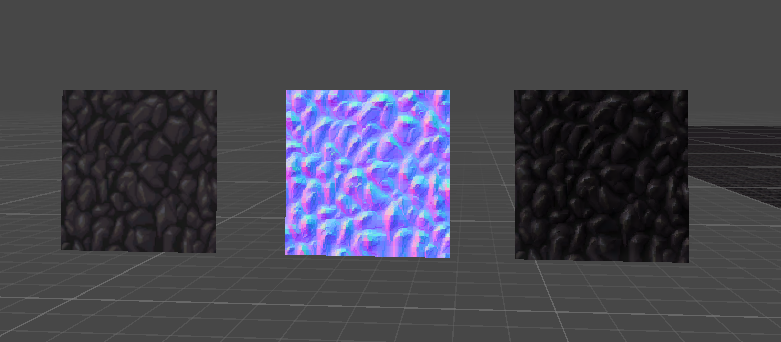
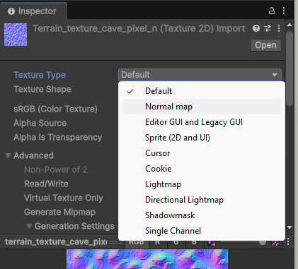
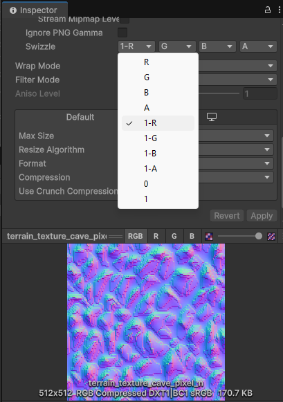
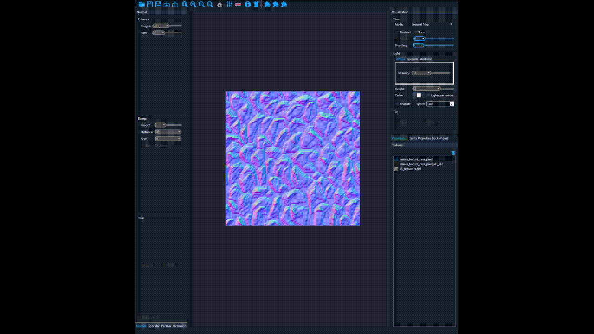

[English version](#analysis) | [日本語版 (AI翻訳)](#日本語版-ai翻訳)

---

## English version
When I was playing on the cave levels of ***SiNiSistar2*** (v1.2.1), I noticed a unique lighting behavior—no matter which direction the light is from, the highlights were "locked" on the **left** edges of the stones. 

They were clearly illuminated by her light when positioned to the right of Lelia; however, once Lelia passes them, they receded into darkness while still shimmering exclusively on their **left** edges. To figure out what caused that, I viewed the textures in Unity. 

Though the textures are pixelated, the outcome looks like a photo of cobble stones lit from the **top-left**. 

### Key Observations:

- The Texture Type of the normal map appears not to be set to `Default` rather than `Normal map` in the inspector. 
- The X-axis (Red channel) of the normal map seems to be inverted. 

By setting the Texture Type to `Normal map` and applying a **Swizzle (1 - R)** to revert the X-axis, I was able to achieve standard physically-based lighting behavior.

### The Question:

I wonder, is this a technical oversight during the export process? Or is it a conscious stylistic choice that reduces specular reflections on terrains, creating a specific high-contrast look that matches the 2D pixel art aesthetic better than physically accurate lighting? It does provide a unique atmosphere in-game, after all.

教えてください，ねんないさま！

---

## 日本語版 (AI翻訳)

洞窟ステージをプレイ中、非常にユニークなライティングの挙動に気づきました。光源がいかなる方向にあっても、石のハイライトが常に「左端」に固定されているように見えたのです。

これらの石は、レリアの右側に位置している間は彼女の明かりで鮮明に照らされますが、レリアが通り過ぎると、ハイライトが左端にのみ残ったまま、暗闇へと沈んでいきました。この原因を特定するため、Unity上でテクスチャを確認しました。

テクスチャはドット絵ですが、その視覚的な結果は、**左上からの光源に照らされた丸石の写真**のように見えます。

### 主な観察結果：

- **テクスチャタイプ:** インスペクター上で、法線マップの `Texture Type` が `Normal map` ではなく `Default` に設定されているようです。
- **チャンネルの反転:** 法線マップの **X軸（Red チャンネル）** が反転しているように見受けられます。

`Texture Type` を `Normal map` に変更し、**Swizzle (1 - R)** を適用してX軸を反転させたところ、標準的な物理ベースのライティング挙動を再現することができました。

### 質問：

これはエクスポート時の技術的な手違い（設定ミス）によるものでしょうか？ あるいは、地形の鏡面反射をあえて抑え、物理的に正確なライティングよりも、2Dドット絵の美学にマッチした高コントラストな外観を作り出すための意図的な演出なのでしょうか？

いずれにせよ、ゲーム内では非常に独特で素晴らしい雰囲気を醸し出していると感じています。

教えてください、ねんないさま！

---

## I tried Laigter, impressive

---
**Disclaimer:** All game assets (textures, characters, etc.) belong to Doujin circle **Uu**, the original developers of _SiNiSistar_ series. This repository is for technical analysis and educational purposes only.
